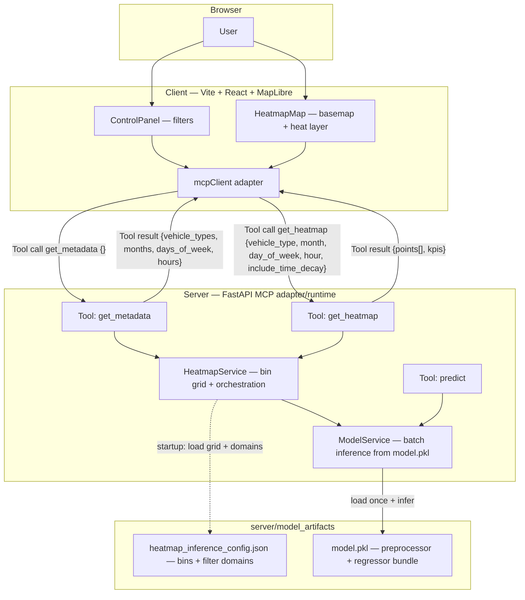
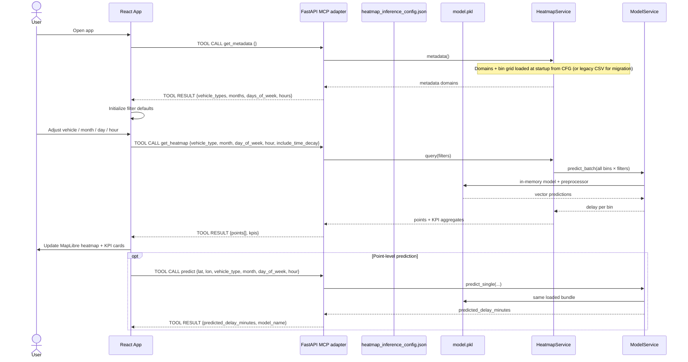

# AI Capstone Project - TTC Delay Prediction SaaS

**Course:** AI Capstone Project - COMP385402.12558.2026W  
**Professor:** Hakim Klif  
**Institution:** Centennial College

## Overview

This repository contains a complete TTC delay prediction workflow:

- **Data & ML:** exploratory analysis and model training in [`aiProject/`](aiProject/)
- **API:** FastAPI backend in [`server/`](server/)
- **UI:** React + Tailwind + MapLibre heatmap client in [`client/`](client/)

Users select **vehicle type**, **month**, **day of week**, and **hour**; the app shows predicted delay intensity on a map and summary KPIs computed **on each request** by the backend model (`model.pkl`) over a fixed geographic bin grid from `heatmap_inference_config.json` (training export). Point-level scoring remains available via `POST /predict`.

## Architecture

High-level view of how the **browser**, **MCP client adapter**, **FastAPI adapter/runtime**, and **artifacts/resources** fit together in a hybrid REST+MCP representation.



### Architecture steps (MCP-style)

1. **Client calls metadata tool** — The frontend adapter sends `get_metadata` with an empty payload. The server returns valid domains for vehicle, month, weekday, and hour (loaded at startup from `heatmap_inference_config.json`, or derived once from the legacy aggregate CSV if that JSON is absent).
2. **Client calls heatmap tool** — The frontend adapter sends `get_heatmap` with typed filters. The server runs **batch inference** over all geographic bins for that time context and returns map points plus KPI aggregates (`avg_delay`, `p90`, `point_count`).
3. **Bin grid resource** — `HeatmapService` holds the list of `(latitude_bin, longitude_bin)` coordinates from `heatmap_inference_config.json` (training export). **No precomputed delay values** are read from CSV for the response; delays are always produced by the model.
4. **Model artifact** — `ModelService` loads `model.pkl` (preprocessor + regressor) once at startup and reuses it for every heatmap and `predict` call.

## Sequence diagram (typical UI session)

How the SPA loads options and refreshes the map when filters change, with explicit tool invocations/results and resource interactions (`include_time_decay` is supported by the API; the current UI sends `false`).



### Sequence steps (MCP-style)

1. **Metadata handshake** — The app calls `get_metadata {}` to bootstrap filter options. The runtime returns domains that were loaded with the bin grid at service startup (from `heatmap_inference_config.json`, or from the legacy aggregate CSV if the JSON is not present yet).
2. **Heatmap query cycle** — The app calls `get_heatmap` with selected filters each time the user changes controls. `HeatmapService` invokes **batch prediction** over the full bin grid for that filter tuple via `ModelService`.
3. **Model-backed map** — Predictions are computed from `model.pkl` for every `(lat_bin, lon_bin)` in the grid; weights and KPIs are derived from those scores (not from precomputed CSV columns).
4. **Optional point prediction** — The app can call `predict` for a single coordinate and time context using the same loaded model bundle.

### Heatmap request latency (reference)

Measured locally with the project `.venv`, `ARTIFACTS_DIR` pointing at existing artifacts, and **~2066** bin points: one heatmap query took **~22–27 ms** after model load; first-time `model.pkl` load was **~1.5 s** (I/O + unpickle). Your numbers will vary with CPU, disk, and grid size.

## Quick start (run the full stack)

1. **Generate model artifacts** (if not already present): run [`aiProject/01_EDA_TTC_Delay_Prediction.ipynb`](aiProject/01_EDA_TTC_Delay_Prediction.ipynb) **or** the OOP pipeline (see [OOP Python pipeline](#oop-python-pipeline-uml)) so the following exist under `server/model_artifacts/` (or set `ARTIFACTS_DIR`):
   - `model.pkl`
   - `heatmap_inference_config.json` (bin grid + filter domains; written by the training export step)
   - Optional legacy file `heatmap_predictions_test_agg.csv` — used only to **derive** bins/metadata if `heatmap_inference_config.json` is missing; heatmap **values** always come from the model at request time.

2. **Start the API** (terminal 1) — see [`server/README.md`](server/README.md) for details.

3. **Start the web client** (terminal 2) — see [`client/README.md`](client/README.md) for details.

Default URLs:

- API: `http://localhost:8000`
- Client: `http://localhost:5173`

## Notebook pipeline (import → `model.pkl`)

Steps follow [`aiProject/01_EDA_TTC_Delay_Prediction.ipynb`](aiProject/01_EDA_TTC_Delay_Prediction.ipynb), one line each from loading data through saving the production bundle.

### EDA and processed dataset

1. **Setup** — Import pandas, NumPy, visualization libraries, define paths to `dataset/` and `outputs/`, and set a random seed for reproducibility.
2. **Unified import** — Load `dataset/ttc_delays_2017_2025_unified_with_coords_corrected.csv` with `read_csv`.
3. **Schema & validation** — Check dtypes, parse `Date`/`Time` into datetimes, and confirm 2017–2025 coverage and column consistency.
4. **Baseline exploration** — Plot quick counts and relationships on the raw unified table before heavy cleaning.
5. **Missing values** — Impute categoricals (e.g., `Unknown`), fill numerics with sensible defaults or medians by vehicle type, and drop rows missing essential timestamps.
6. **Feature engineering** — Derive hour, month, day-of-week, cyclical encodings, seasonality, and set **Min Delay** as the regression target.
7. **Normalization / transformation** — Apply log or scaling to skewed columns where the EDA recommends it.
8. **Imbalance** — Analyze record counts by year and vehicle type to understand sampling bias.
9. **Processed summary** — Review the cleaned frame before persisting.
10. **Save treated dataset** — Write the engineered table (e.g., `aiProject/outputs/ttc_delays_2017_2025_unified_with_coords_corrected_treated.csv`) for the modeling section.

### Modeling section (training pipeline → artifacts)

11. **Modeling dataframe** — Reload the treated CSV and build the tabular base used for train/validation/test.
12. **Target & time features** — Clean **Min Delay**, drop invalid targets, and align calendar features used at inference.
13. **Temporal split & outliers** — Split by time (train / validation / test) and cap extreme delays using statistics computed **only on training** to limit leakage.
14. **Inference-only features** — Build a sklearn `Pipeline` with columns available in production (e.g., vehicle, month, weekday, hour, latitude, longitude), **excluding** leakage-prone fields such as `Delay_Ratio`, `Min Gap`, raw vehicle id, delay codes, and station text.
15. **Train LightGBM** — Fit the gradient-boosting regressor inside the preprocessing pipeline.
16. **Train XGBoost** — Fit an alternative booster for comparison on the same feature matrix.
17. **Model selection** — Compare LightGBM vs. XGBoost on validation and test metrics and record the winner.
18. **Production bundle & heatmap export** — Retrain the best model on train+validation, serialize the **preprocessor + regressor** bundle with `joblib.dump` to **`server/model_artifacts/model.pkl`**, write **`heatmap_inference_config.json`** (unique bins + filter domains), and optionally keep **`heatmap_predictions_test_agg.csv`** as an offline aggregate (the live API heatmap uses the model, not CSV values).

## OOP Python pipeline (UML)

The notebook is also available as an **object-oriented** package under [`aiProject/ttc_pipeline/`](aiProject/ttc_pipeline/): stage classes in [`eda_stages.py`](aiProject/ttc_pipeline/eda_stages.py), training in [`training_stages.py`](aiProject/ttc_pipeline/training_stages.py), and a façade [`TTCDelayPipeline`](aiProject/ttc_pipeline/orchestrator.py) in [`orchestrator.py`](aiProject/ttc_pipeline/orchestrator.py). Training dependencies match [`server/requirements.txt`](server/requirements.txt) / [`aiProject/requirements.txt`](aiProject/requirements.txt) (`lightgbm`, `xgboost`, etc.).

**Run from the repository root** (install `aiProject` requirements first; use `--no-plots` in headless environments):

```bash
python -m aiProject.ttc_pipeline           # EDA + training (same end state as full notebook)
python -m aiProject.ttc_pipeline eda       # only treated CSV
python -m aiProject.ttc_pipeline training  # only models (expects treated CSV on disk)
python -m aiProject.ttc_pipeline all --no-plots
```

### UML (classes and relationships)

`TTCDelayPipeline` owns a `PipelineConfig` and delegates each notebook block to a small class; `ModelTrainingPipeline` is created only for the training phase so importing the package does not require `lightgbm` until you train.


### UML steps

1. **Pipeline configuration** — `PipelineConfig` centralizes paths (`dataset`, treated CSV, `server/model_artifacts`) and runtime flags. Every stage receives consistent location and behavior settings.
2. **EDA orchestration** — `TTCDelayPipeline` delegates each notebook phase to focused classes (`Loader`, `Validator`, `FeatureEngineer`, etc.). The output is a treated dataset that matches the training contract.
3. **Training orchestration** — `TTCDelayPipeline` creates `ModelTrainingPipeline` only when training is requested. This keeps EDA-only runs decoupled from heavy model dependencies.
4. **Artifact production** — `ModelTrainingPipeline` trains/compares models and exports `model.pkl` and heatmap aggregates to `server/model_artifacts`. The server can immediately consume those files without extra path remapping.

## Project structure

```text
centennialCollege_AICapstoneProject/
├── aiProject/
│   ├── 01_EDA_TTC_Delay_Prediction.ipynb
│   ├── ttc_pipeline/       # OOP port of the notebook (see README UML)
│   │   ├── config.py
│   │   ├── eda_stages.py
│   │   ├── training_stages.py
│   │   ├── orchestrator.py
│   │   └── __main__.py
│   └── requirements.txt
├── server/                 # FastAPI — see server/README.md
│   ├── model_artifacts/
│   │   ├── model.pkl
│   │   ├── heatmap_inference_config.json
│   │   └── heatmap_predictions_test_agg.csv
│   └── app/
├── client/                 # React + Vite — see client/README.md
├── dataset/
└── README.md               # this file
```

## Dataset

TTC historical delay data (2017–2025) for bus, streetcar, and subway.

**Source:** [Toronto Open Data Portal](https://open.toronto.ca/)

## Documentation

| Topic | File |
|--------|------|
| Run the API | [`server/README.md`](server/README.md) |
| Run the web app | [`client/README.md`](client/README.md) |
| OOP ML pipeline | [`aiProject/ttc_pipeline/`](aiProject/ttc_pipeline/) |

## Team

1. Absar Siddiqui-Atta  
2. Bruna De Fatima Miranda Figueiredo Cruz  
3. Felipe Rosa  
4. Krishan Singh  
5. Marco Favaretto  
