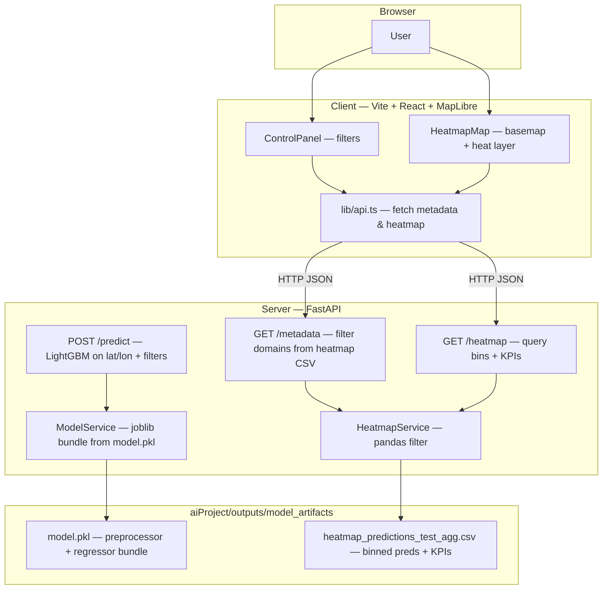
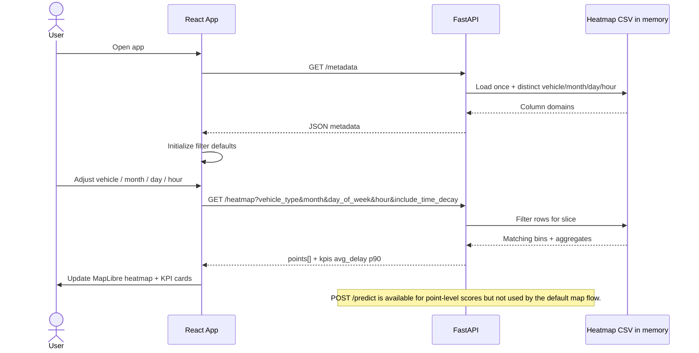

# AI Capstone Project - TTC Delay Prediction SaaS

**Course:** AI Capstone Project - COMP385402.12558.2026W  
**Professor:** Hakim Klif  
**Institution:** Centennial College

## Overview

This repository contains a complete TTC delay prediction workflow:

- **Data & ML:** exploratory analysis and model training in [`aiProject/`](aiProject/)
- **API:** FastAPI backend in [`server/`](server/)
- **UI:** React + Tailwind + MapLibre heatmap client in [`client/`](client/)

Users select **vehicle type**, **month**, **day of week**, and **hour**; the app shows predicted delay intensity on a map and summary KPIs (loaded from pre-aggregated predictions; the API can also score single points via `POST /predict`).

## Architecture

High-level view of how the **browser**, **React client**, **FastAPI**, and **artifacts** fit together (see [`client/`](client/) and [`server/`](server/) for implementation details).



## Sequence diagram (typical UI session)

How the SPA loads options and refreshes the map when filters change (`include_time_decay` is supported by the API; the current UI sends `false`).



## Quick start (run the full stack)

1. **Generate model artifacts** (if not already present): run [`aiProject/01_EDA_TTC_Delay_Prediction.ipynb`](aiProject/01_EDA_TTC_Delay_Prediction.ipynb) so the following files exist:
   - `aiProject/outputs/model_artifacts/model.pkl`
   - `aiProject/outputs/model_artifacts/heatmap_predictions_test_agg.csv`

2. **Start the API** (terminal 1) — see [`server/README.md`](server/README.md) for details.

3. **Start the web client** (terminal 2) — see [`client/README.md`](client/README.md) for details.

Default URLs:

- API: `http://localhost:8000`
- Client: `http://localhost:5173`

## Notebook pipeline (import → `model.pkl`)

Steps follow [`aiProject/01_EDA_TTC_Delay_Prediction.ipynb`](aiProject/01_EDA_TTC_Delay_Prediction.ipynb), one line each from loading data through saving the production bundle.

### EDA and processed dataset

1. **Setup** — Import pandas, NumPy, visualization libraries, define paths to `dataset/` and `outputs/`, and set a random seed for reproducibility.
2. **Unified import** — Load `dataset/ttc_delays_2017_2025_unified_with_coords_corrected.csv` with `read_csv`.
3. **Schema & validation** — Check dtypes, parse `Date`/`Time` into datetimes, and confirm 2017–2025 coverage and column consistency.
4. **Baseline exploration** — Plot quick counts and relationships on the raw unified table before heavy cleaning.
5. **Missing values** — Impute categoricals (e.g., `Unknown`), fill numerics with sensible defaults or medians by vehicle type, and drop rows missing essential timestamps.
6. **Feature engineering** — Derive hour, month, day-of-week, cyclical encodings, seasonality, and set **Min Delay** as the regression target.
7. **Normalization / transformation** — Apply log or scaling to skewed columns where the EDA recommends it.
8. **Imbalance** — Analyze record counts by year and vehicle type to understand sampling bias.
9. **Processed summary** — Review the cleaned frame before persisting.
10. **Save treated dataset** — Write the engineered table (e.g., `aiProject/outputs/ttc_delays_2017_2025_unified_with_coords_corrected_treated.csv`) for the modeling section.

### Modeling section (training pipeline → artifacts)

11. **Modeling dataframe** — Reload the treated CSV and build the tabular base used for train/validation/test.
12. **Target & time features** — Clean **Min Delay**, drop invalid targets, and align calendar features used at inference.
13. **Temporal split & outliers** — Split by time (train / validation / test) and cap extreme delays using statistics computed **only on training** to limit leakage.
14. **Inference-only features** — Build a sklearn `Pipeline` with columns available in production (e.g., vehicle, month, weekday, hour, latitude, longitude), **excluding** leakage-prone fields such as `Delay_Ratio`, `Min Gap`, raw vehicle id, delay codes, and station text.
15. **Train LightGBM** — Fit the gradient-boosting regressor inside the preprocessing pipeline.
16. **Train XGBoost** — Fit an alternative booster for comparison on the same feature matrix.
17. **Model selection** — Compare LightGBM vs. XGBoost on validation and test metrics and record the winner.
18. **Production bundle & heatmap export** — Retrain the best model on train+validation, serialize the **preprocessor + regressor** bundle with `joblib.dump` to **`model.pkl`**, and aggregate test predictions by lat/lon/time bins into **`heatmap_predictions_test_agg.csv`** for the API heatmap endpoint.

## Project structure

```text
centennialCollege_AICapstoneProject/
├── aiProject/
│   ├── 01_EDA_TTC_Delay_Prediction.ipynb
│   ├── outputs/model_artifacts/
│   │   ├── model.pkl
│   │   └── heatmap_predictions_test_agg.csv
│   └── requirements.txt
├── server/                 # FastAPI — see server/README.md
├── client/                 # React + Vite — see client/README.md
├── dataset/
└── README.md               # this file
```

## Dataset

TTC historical delay data (2017–2025) for bus, streetcar, and subway.

**Source:** [Toronto Open Data Portal](https://open.toronto.ca/)

## Documentation

| Topic | File |
|--------|------|
| Run the API | [`server/README.md`](server/README.md) |
| Run the web app | [`client/README.md`](client/README.md) |

## Team

1. Absar Siddiqui-Atta  
2. Bruna De Fatima Miranda Figueiredo Cruz  
3. Felipe Rosa  
4. Krishan Singh  
5. Marco Favaretto  
