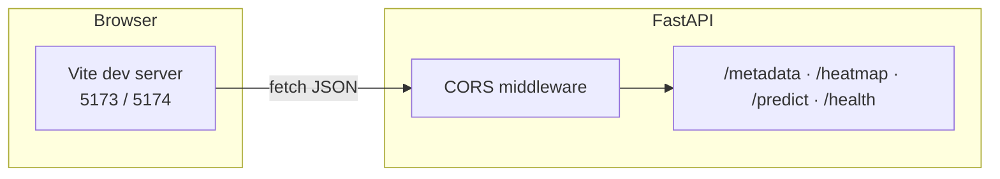

# TTC Delay Prediction — API server

FastAPI service: model inference, heatmap data, and metadata for the web client.

## Prerequisites

- **Python** 3.10+ recommended  
- **Model artifacts** (from the EDA notebook / OOP pipeline). By default the API looks for `model.pkl` in **`server/model_artifacts/`** first; if it is not there but exists under **`aiProject/outputs/model_artifacts/`**, that folder is used automatically (no copy, no `ARTIFACTS_DIR`, unless you want to override).
  - `model.pkl`
  - `heatmap_inference_config.json` — **required** to start the API: `metadata`, `bins`, and `context_bin_indices` (per-filter bin subsets; keys `vehicle_type|month|day_of_week|hour`). Produced by `python -m aiProject.ttc_pipeline training`.
  - Optional: `heatmap_predictions_test_agg.csv` — written during training for offline analysis; **not** used by the heatmap API.

Paths are resolved from the **repository root** (see `app/config.py`). Override with **`ARTIFACTS_DIR`** if your files live elsewhere.

## Install

Use a **virtual environment** at the repo root (recommended so `lightgbm` and other deps match what loads `model.pkl`):

```bash
cd your-clone/centennialCollege_AICapstoneProject   # use the real path to this repo (not literally /path/to/...)
python -m venv .venv
source .venv/bin/activate   # Windows: .venv\Scripts\activate
pip install -r server/requirements.txt
```

## Run (development)

The Python package is **`app`** inside the **`server/`** folder. You must put **`server` on `PYTHONPATH`** (or run from inside `server/` with `PYTHONPATH=.`).  
**Do not** use `PYTHONPATH=.` from the **repository root** — that breaks imports (`No module named 'app'`).

**Recommended — from the repository root** (after `cd` into the repo folder):

```bash
source .venv/bin/activate
PYTHONPATH=server uvicorn app.main:app --reload --host 0.0.0.0 --port 8000
```

**Port 8000 already in use** (e.g. another Python app or Django): run Uvicorn on a free port and point the Vite client at it with `VITE_API_URL` (see `client/README.md`):

```bash
PYTHONPATH=server uvicorn app.main:app --reload --host 0.0.0.0 --port 8001
```

If `model.pkl` exists under `aiProject/outputs/model_artifacts/` but not under `server/model_artifacts/`, the server **auto-detects** that folder — you do not need `export ARTIFACTS_DIR=...` unless you want to force a path.

**Force a specific artifacts folder** (optional):

```bash
export ARTIFACTS_DIR="$(pwd)/aiProject/outputs/model_artifacts"
PYTHONPATH=server uvicorn app.main:app --reload --host 0.0.0.0 --port 8000
```

(On Windows PowerShell, set `ARTIFACTS_DIR` to an absolute path to that folder.)

**From the `server/` directory:**

```bash
cd server
source ../.venv/bin/activate
PYTHONPATH=. uvicorn app.main:app --reload --host 0.0.0.0 --port 8000
```

- API docs: **http://localhost:8000/docs** (same path on whatever host/port you bind, e.g. **http://127.0.0.1:8001/docs**)
- Health: **GET** `http://localhost:8000/health`

## Runtime diagram (dev)



## Environment variables

Optional overrides (see `server/.env.example`):

| Variable | Purpose |
|----------|---------|
| `ARTIFACTS_DIR` | Folder containing artifacts (default: `<repo>/server/model_artifacts`) |
| `MODEL_FILE` | Path to `model.pkl` |
| `HEATMAP_FILE` | Path to `heatmap_predictions_test_agg.csv` (optional; not read by the heatmap API) |
| `HEATMAP_INFERENCE_CONFIG` | Path to `heatmap_inference_config.json` (**required** for `/heatmap` and `/metadata`) |
| `CORS_ORIGINS` | Comma-separated browser origins. Defaults include **localhost and 127.0.0.1** on **5173** and **5174** (Vite may use either port; `localhost` vs `127.0.0.1` are different origins). |

Example when running only from `server/` with relative paths:

```bash
export ARTIFACTS_DIR=./model_artifacts
export CORS_ORIGINS=http://localhost:5173,http://127.0.0.1:5173
PYTHONPATH=. uvicorn app.main:app --reload --port 8000
```

Or copy `server/.env.example` to `server/.env` and load it with your process manager / `python-dotenv` if you add that.

## Troubleshooting

- **`ModuleNotFoundError: No module named 'app'`** — You ran `uvicorn` with the wrong `PYTHONPATH`. From the **repo root**, use `PYTHONPATH=server` (not `PYTHONPATH=.`). Or `cd server` and use `PYTHONPATH=.`.
- **`FileNotFoundError: Model file not found: .../model.pkl`** — Ensure `model.pkl` exists in **`server/model_artifacts/`** or **`aiProject/outputs/model_artifacts/`** (the latter is auto-used if the former has no model). Otherwise set **`ARTIFACTS_DIR`** to the folder that contains `model.pkl`. Do not paste the literal path `/path/to/centennialCollege_AICapstoneProject` from docs — use your real project directory.
- **`FileNotFoundError: Heatmap inference config not found: .../heatmap_inference_config.json`** — Run training export: `python -m aiProject.ttc_pipeline training` (from repo root, venv active) so `heatmap_inference_config.json` is written next to `model.pkl`, or set **`HEATMAP_INFERENCE_CONFIG`** to an existing file path.
- **`ValueError: heatmap_inference_config.json is outdated`** — Your JSON predates `context_bin_indices`. Re-run `python -m aiProject.ttc_pipeline training` to regenerate the config.
- **`ModuleNotFoundError: No module named 'lightgbm'`** — Install dependencies with `pip install -r server/requirements.txt` inside the **same** virtualenv you use to run `uvicorn`.
- **Wrong working directory** — If artifact paths fail, run from repo root or set `ARTIFACTS_DIR` / `MODEL_FILE` / `HEATMAP_FILE` / `HEATMAP_INFERENCE_CONFIG` explicitly.

## Client

Start the React app from [`../client/README.md`](../client/README.md). Vite typically serves **http://localhost:5173**; if that port is busy it may use **5174** or another port. Open the app with the same hostname style you configured in `CORS_ORIGINS` (`localhost` vs `127.0.0.1`).
